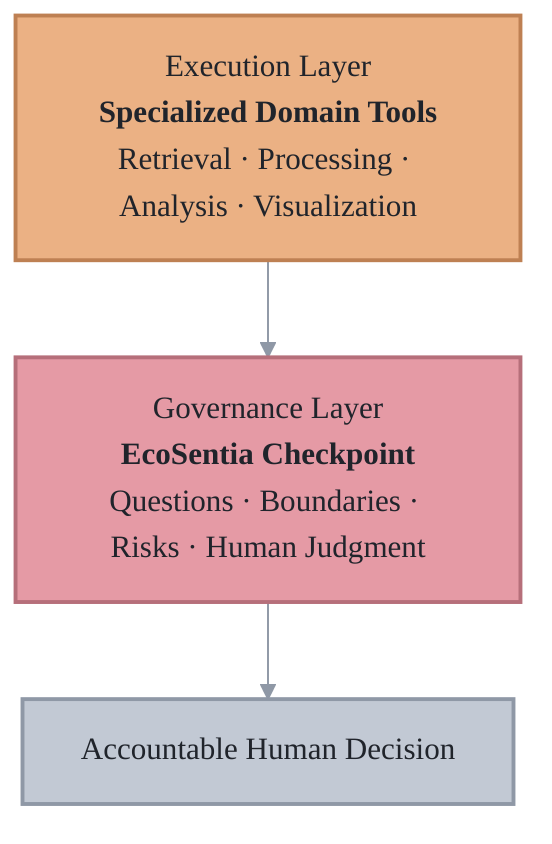

<div align="center">

# EcoSentia

### A Human-Centric Governance Framework for Evidence-Aware AI-Assisted Biomimetic Design

<br>

[](#ecosentia-framework)
[](#evidence-interpretation)
[](#five-analytical-lenses)
[](#research-status)
[](#license)

<br>

**Evaluate evidence. Expose assumptions. Map uncertainty. Retain human judgment.**

<br>

[Access the Checkpoint](https://huggingface.co/spaces/Sogandste/EcoSentia)
&nbsp;&nbsp;·&nbsp;&nbsp;
[Explore the Repository](https://github.com/Sogandste/EcoSentia)
&nbsp;&nbsp;·&nbsp;&nbsp;
[Report an Issue](https://github.com/Sogandste/EcoSentia/issues)

</div>

---

## EcoSentia Framework

EcoSentia is a human-centric governance framework for critically examining
AI-generated biomimetic design claims before they are interpreted as
scientifically grounded, functionally validated, or design-ready.

Its software implementation, the **EcoSentia Checkpoint**, introduces
structured cognitive friction into AI-assisted biomimetic reasoning. It helps
users retrieve related literature, inspect evidence signals, identify
translation risks, map uncertainty, and refine claims while keeping final
interpretation under accountable human judgment.

> EcoSentia does not determine whether a biomimetic claim is true. It structures
> the questions, evidence, risks, and uncertainties that humans should examine
> before acting on that claim.

---

## Why EcoSentia?

AI systems can rapidly produce convincing biological analogies and design
proposals. Fluency, however, may conceal important limitations:

| Potential limitation | Critical question |
|:---|:---|
| Biological resemblance without mechanism | Does the proposed function follow from an identified mechanism? |
| Incomplete evidence alignment | Do the retrieved studies directly support the evaluated claim? |
| Context omission | Will the biological strategy remain meaningful outside its original conditions? |
| Scale-dependent failure | Does the principle survive transfer across spatial, temporal, or organizational scales? |
| Manufacturing assumptions | Can the concept be fabricated reproducibly and maintained in practice? |
| Safety silence | Are biological, environmental, clinical, or regulatory risks acknowledged? |

EcoSentia makes these issues visible before an AI-generated statement is treated
as a validated design proposition.

---

## Checkpoint Workflow

The EcoSentia Checkpoint implements a five-step evaluation pipeline.

```mermaid
%%{init: {
  "theme": "base",
  "themeVariables": {
    "fontFamily": "Times New Roman, serif",
    "primaryTextColor": "#20242b",
    "lineColor": "#8f98a6",
    "tertiaryColor": "#ffffff"
  },
  "flowchart": {
    "curve": "basis",
    "htmlLabels": true
  }
}}%%

flowchart LR
    C["Biomimetic<br/>Claim"] --> P["1. Pathway<br/>Classification"]
    P --> E["2. Evidence<br/>Retrieval"]
    E --> S["3. Support-Level<br/>Summary"]
    S --> R["4. Multi-Lens<br/>Risk Screening"]
    R --> H["5. Structured Human<br/>Interrogation"]
    H --> O["Evidence-Aware<br/>Claim"]

    style C fill:#d9dde5,stroke:#8f98a6,stroke-width:2px,color:#20242b
    style P fill:#e59aa5,stroke:#b66f7a,stroke-width:2px,color:#20242b
    style E fill:#ebb184,stroke:#be8053,stroke-width:2px,color:#20242b
    style S fill:#e3a377,stroke:#b87547,stroke-width:2px,color:#20242b
    style R fill:#c2c9d4,stroke:#8f98a6,stroke-width:2px,color:#20242b
    style H fill:#e59aa5,stroke:#b66f7a,stroke-width:2px,color:#20242b
    style O fill:#d9dde5,stroke:#8f98a6,stroke-width:2px,color:#20242b
```



### 1. Pathway Classification

Classifies the claim according to its apparent biomimetic reasoning pathway and
identifies the assumptions that require closer examination.

### 2. Evidence Retrieval

Retrieves related scientific records through **PubMed** and **OpenAlex** to
provide broad, cross-disciplinary literature coverage.

### 3. Support-Level Summary

Summarizes the volume and recency of related literature as a navigational
signal. The support level does not measure scientific validity, study quality,
functional performance, or safety.

### 4. Multi-Lens Risk Screening

Screens the claim through five analytical lenses to identify characteristic
translation risks requiring human review.

### 5. Structured Human Interrogation

Generates prompts for evaluation, counter-analysis, uncertainty mapping, and
claim redesign.

---

## Five Analytical Lenses

| Lens | What it examines | Representative concern |
|:---|:---|:---|
| **Mechanism** | Whether the proposed function is connected to an identified biological or engineering mechanism | Form is transferred without causal explanation |
| **Context** | Whether ecological, physiological, environmental, and operational conditions are considered | A biological strategy is removed from the conditions enabling it |
| **Scale** | Whether the principle remains meaningful across spatial, temporal, material, or organizational scales | Scale-dependent behavior is assumed to remain unchanged |
| **Manufacturability** | Whether fabrication, reproducibility, durability, maintenance, and deployment are acknowledged | Practical implementation is implied without fabrication evidence |
| **Safety** | Whether biological, environmental, toxicological, clinical, ethical, and regulatory concerns are addressed | High-impact applications are described without relevant safety boundaries |

These lenses are diagnostic structures for human reasoning. They are not
automated validation criteria.

---

## Translation-Risk Flags

The Checkpoint uses rule-based screening to identify issues that may be hidden
by confident or oversimplified language.

| Risk flag | Interpretation |
|:---|:---|
| **Morphology Overreach** | Visible biological form or surface resemblance is treated as sufficient evidence of functional transfer |
| **Mechanism Gap** | The claimed outcome is not adequately connected to a defined mechanism |
| **Context Transfer Risk** | Relevant biological, environmental, physiological, or operational conditions are omitted |
| **Scale Neglect** | The claim assumes transfer across scales without examining scale-dependent constraints |
| **Manufacturability Assumption** | Fabrication, reproducibility, durability, maintenance, or cost is implied rather than demonstrated |
| **Safety Silence** | Relevant toxicity, exposure, immune, environmental, ethical, or regulatory concerns are not addressed |

A flag indicates a question requiring investigation. It does not prove that a
claim is incorrect.

The absence of a flag does not establish scientific validity, feasibility, or
safety.

---

## Structured Prompt Outputs

For each evaluated claim, the Checkpoint generates four complementary prompt
types.

<table>
<tr>
<td width="50%" valign="top">

### Evaluation

Examines evidence alignment, mechanism, context, assumptions, and limitations.

</td>
<td width="50%" valign="top">

### Counter-Prompt

Challenges the claim through failure modes, contradictory evidence, and
alternative explanations.

</td>
</tr>
<tr>
<td width="50%" valign="top">

### Uncertainty Mapping

Separates established evidence from inference, unresolved assumptions, and
speculative extension.

</td>
<td width="50%" valign="top">

### Redesign

Reformulates the claim into a more specific, evidence-aware, risk-explicit, and
responsibly bounded statement.

</td>
</tr>
</table>

Together, these outputs position AI as a **productive adversary** rather than an
automatic scientific authority.

---

## Interpretation States

Checkpoint outputs can be organized into three human-readable states.

| State | Meaning | Required interpretation |
|:---|:---|:---|
| **Grounded** | The claim shows comparatively stronger alignment with retrieved literature and makes relevant mechanisms and boundaries more explicit | Grounded does not mean experimentally validated |
| **Simulate** | The claim may support structured exploration but retains important assumptions or unresolved uncertainties | Further analysis and testing are required |
| **AI Blindspot** | Major evidentiary, mechanistic, contextual, manufacturing, or safety omissions may be hidden by fluent AI language | The claim requires substantial human interrogation |

These states support deliberation and prioritization. They are not scientific
verdicts or readiness classifications.

---

## Demonstration Cases

### Passive Fog Harvesting

Evaluation of water-harvesting concepts inspired by biological systems such as
the Namib Desert beetle and cactus spines.

**Primary analytical concerns**

- Surface morphology and wettability
- Droplet nucleation and directional transport
- Environmental and operational context
- Morphology-to-mechanism correspondence
- Fabrication, durability, and deployment constraints

The literature may support individual biological or physical principles without
validating the functional success of a complete engineered system.

### Extracellular-Vesicle-Inspired Nanomedicine

Evaluation of extracellular-vesicle-inspired systems proposed for targeted drug
delivery in inflammatory disease.

**Primary analytical concerns**

- Biological source and composition
- Targeting mechanism
- Cargo loading and release
- Biodistribution and immune interaction
- Toxicity and biological safety
- Manufacturing reproducibility
- Translational and regulatory constraints

Related literature does not independently establish clinical efficacy, clinical
safety, or therapeutic readiness.

### Additional Evaluation Claims

The framework can also be tested using claims involving:

- Synapse-inspired neuromorphic control for soft robotics
- Unicorn-horn-inspired spontaneous energy generation
- Shark-skin-inspired drag-reducing surfaces

These claims enable examination of mechanism gaps, unsupported extrapolation,
context transfer, manufacturability assumptions, and safety silence across
different domains.

---

## Evidence Interpretation

The Checkpoint retrieves related records and summarizes evidence signals to
support navigation and critical review.

### What the support level represents

The support-level heuristic primarily reflects:

- The number of retrieved records
- The number of apparently direct matches
- The recency of related publications
- The available literature under the selected search parameters

### What the support level does not represent

It does not independently measure:

- Scientific validity
- Methodological quality
- Causal accuracy
- Experimental reproducibility
- Functional performance
- Prototype readiness
- Clinical effectiveness
- Safety
- Regulatory acceptability

A large number of related publications does not validate the evaluated claim.
A small number of retrieved records does not prove that the claim is false.

Search results may vary because of query construction, terminology, database
coverage, metadata quality, indexing updates, API availability, retrieval date,
and result limits.

---

## Reproducible Evaluation

For each reported run, record the following information:

- Complete input claim
- Biological model
- Application context
- Target function
- Mechanism keywords
- Excluded terms
- Selected pathway or preset
- Data sources
- Maximum results per source
- Retrieval date and time
- Total retrieved records
- Direct matches
- Support-level output
- Flagged risks
- Top retrieved records
- Relevant exported outputs or time-stamped screenshots

For comparative analyses, runs should use the same retrieval settings unless a
difference is explicitly reported as a sensitivity analysis.

External search results may change over time as PubMed and OpenAlex update their
records and indexing systems.

---

## Research Design

EcoSentia is developed through a convergent three-strand research design:

1. **Bibliometric analysis**  
   Mapping research patterns at the intersection of artificial intelligence
   and biomimetics.

2. **Design-science artifact implementation**  
   Translating the governance framework into the EcoSentia Checkpoint.

3. **Expert formative evaluation**  
   Examining clarity, usefulness, critical-reasoning support, interpretability,
   usability, and educational potential.

Expert feedback supports iterative refinement of the artifact. It does not
constitute experimental, clinical, safety, or regulatory validation.

---

## Two-Layer Architecture



The execution layer retrieves and processes information. The governance layer
structures how outputs should be questioned, bounded, interpreted, and
documented.

Neither layer independently determines whether a claim is valid or ready for
implementation.

---

## Intended Users

EcoSentia is designed for:

- Biomimetic researchers
- Designers and engineers
- Computational biologists
- Interdisciplinary research teams
- Educators and students
- Scientific reviewers
- Developers of responsible AI tools

It is particularly relevant when AI-generated language appears more certain
than the available evidence permits.

---

## Appropriate Use

EcoSentia can support:

- Critical evaluation of AI-generated biomimetic claims
- Broad literature retrieval
- Identification of assumptions and evidence gaps
- Screening for characteristic translation risks
- Structured interdisciplinary discussion
- Refinement of early-stage claims
- Documentation of human-led reasoning
- Teaching and formative evaluation
- Comparison of claims under consistent settings

---

## Limitations and Prohibited Interpretation

EcoSentia must not be used to:

- Present speculative claims as validated findings
- Replace expert scientific review
- Infer validity from publication volume
- Treat a risk flag as proof that a claim is false
- Treat the absence of a flag as evidence of safety
- Present a Grounded state as experimental validation
- Claim prototype readiness without physical evaluation
- Claim clinical efficacy without appropriate clinical evidence
- Make autonomous clinical, safety, or regulatory decisions
- Advance high-stakes claims without relevant domain expertise

Rule-based screening may produce false positives or false negatives. Literature
retrieval may omit relevant studies or return indirectly related records.
Outputs therefore require inspection and expert interpretation.

---

## Local Installation

### Clone the repository

```bash
git clone https://github.com/Sogandste/EcoSentia.git
cd EcoSentia
```

### Create a virtual environment

```bash
python -m venv .venv
```

### Activate the environment

**macOS or Linux**

```bash
source .venv/bin/activate
```

**Windows**

```bash
.venv\Scripts\activate
```

### Install the dependencies

```bash
pip install -r requirements.txt
```

### Run the application

```bash
python app.py
```

The local address will be displayed in the terminal after the application
starts.

---

## Configuration and API Use

The Checkpoint may access external literature services, including PubMed and
OpenAlex.

Users should:

- Keep API keys outside the source code
- Use environment variables or secure platform secrets
- Never commit private credentials
- Document retrieval parameters used in reported analyses
- Consider API availability and indexing changes when interpreting results
- Review database usage policies and request limits

---

## Repository Structure

```text
EcoSentia/
├── app.py
├── requirements.txt
├── README.md
├── LICENSE
├── assets/
├── Bibliometric/
└── supporting-materials/
```

Repository contents may evolve as the software, analyses, documentation, and
reproducibility materials are refined.

---

## Research Status

[](#research-status)
[](#research-status)
[](#research-status)

EcoSentia is an active research project. The associated manuscript has not yet
been published.

This repository should be interpreted as a research implementation rather than
a validated scientific, engineering, clinical, or regulatory system.

No physical prototype, wet-lab validation, animal validation, clinical
validation, or regulatory approval is claimed.

The interface, retrieval behavior, screening logic, documentation, and
supporting materials may change during continued development and evaluation.

---

## Citation

The associated manuscript has not yet been published. Formal citation metadata
will be added when a public manuscript record becomes available.

Until then, the project may be referenced as:

> **EcoSentia: A Human-Centric Governance Framework for Evidence-Aware
> AI-Assisted Biomimetic Design.**  
> Software repository: <https://github.com/Sogandste/EcoSentia>

Include the repository access date when required by the selected citation
style.

---

## Contributing

Contributions that improve transparency, reproducibility, usability,
accessibility, documentation, or testing are welcome.

Relevant contribution areas include:

- Evidence-query construction
- Retrieval reliability
- Risk-screening logic
- Domain-specific terminology
- Negative-control claims
- Interface accessibility
- Reproducibility documentation
- Test coverage
- Output and reporting functions

Changes affecting retrieval, support-level classification, or risk-screening
behavior should be documented explicitly.

---

## Responsible Use

Users remain responsible for:

- Inspecting the retrieved literature
- Evaluating study quality and relevance
- Consulting appropriate domain experts
- Documenting assumptions and uncertainties
- Conducting necessary experimental evaluation
- Assessing ethical and safety implications
- Following institutional and regulatory requirements

EcoSentia is intended to strengthen accountable inquiry, not automate
scientific authority.

---

## License

This project is distributed under the **MIT License**.

Use, modification, and redistribution are permitted under the conditions stated
in the [`LICENSE`](LICENSE) file.

The software is provided without warranty. Scientific, engineering, clinical,
ethical, safety, and regulatory interpretations remain the responsibility of
the user.

---

<div align="center">

### Core Proposition

**The central question is not whether AI can generate a biomimetic idea.**

**The central question is whether humans can identify what supports that idea,
what it assumes, where it may fail, and which decisions must remain under
accountable human judgment.**

<br>

[](https://github.com/Sogandste/EcoSentia)

</div>
